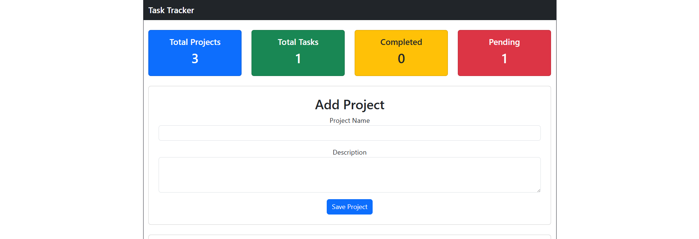
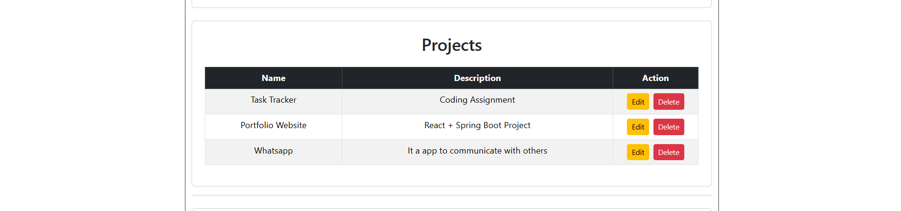
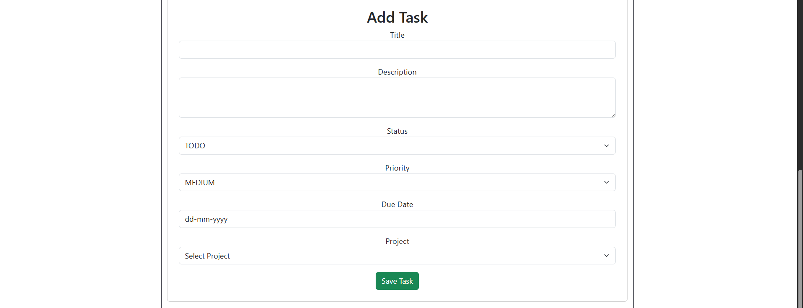

# task-tracker

Full-stack Task Tracker built with Spring Boot, React, and MySQL.

# Task Tracker Application

A full-stack Task Tracker application built using **Spring Boot**, **React**, **MySQL**, and **Bootstrap**. This application helps users create and manage projects and tasks with complete CRUD functionality.

---

## Features

### Project Management

- Add Project
- View Projects
- Edit Project
- Delete Project

### Task Management

- Add Task
- View Tasks
- Edit Task
- Delete Task
- Search Tasks
- Filter by Status
- Filter by Priority

### Dashboard

- Total Projects
- Total Tasks
- Completed Tasks
- Pending Tasks

---

## Tech Stack

### Frontend

- React
- Vite
- Bootstrap 5
- Axios

### Backend

- Java 17+
- Spring Boot 3.5.16
- Spring Data JPA
- Hibernate

### Database

- MySQL 8

### Tools

- Visual Studio Code
- Postman
- Git
- GitHub
- Maven

---

## Project Structure

```
TaskTracker/
│
├── backend/
│   ├── src/
│   ├── pom.xml
│   └── application.properties
│
├── frontend/
│   ├── src/
│   ├── package.json
│   └── vite.config.js
│
└── README.md
```

---

## Installation

### Clone Repository

```bash
git clone https://github.com/sanjayannamalai20/task-tracker.git
```

---

### Backend

```bash
cd backend
```

Run the application

```bash
./mvnw spring-boot:run
```

Backend URL

```
http://localhost:8080
```

---

### Frontend

```bash
cd frontend
npm install
npm run dev
```

Frontend URL

```
http://localhost:5173
```

---

## Database

Create a MySQL database

```
tasktracker_db
```

Update your `application.properties`

```properties
spring.datasource.url=jdbc:mysql://localhost:3306/tasktracker_db
spring.datasource.username=root
spring.datasource.password=your_password

spring.jpa.hibernate.ddl-auto=update
```

---

## REST APIs

### Project APIs

| Method | Endpoint           |
| ------ | ------------------ |
| GET    | /api/projects      |
| GET    | /api/projects/{id} |
| POST   | /api/projects      |
| PUT    | /api/projects/{id} |
| DELETE | /api/projects/{id} |

---

### Task APIs

| Method | Endpoint        |
| ------ | --------------- |
| GET    | /api/tasks      |
| GET    | /api/tasks/{id} |
| POST   | /api/tasks      |
| PUT    | /api/tasks/{id} |
| DELETE | /api/tasks/{id} |

---

# Screenshots

## Dashboard

## 📸 Screenshots

### Dashboard



### Projects



### Tasks



### Search & Filter


## Author

**Sanjay Kumar A**

- MCA Graduate (2025)
- Java Full Stack Developer
- GitHub: https://github.com/sanjayannamalai20

---

## Future Enhancements

- User Authentication (JWT)
- Role-Based Access
- Email Notifications
- File Attachments
- Dark Mode
- Task Categories
- Task Comments
- Dashboard Charts
- Deployment on AWS / Render / Vercel

---
